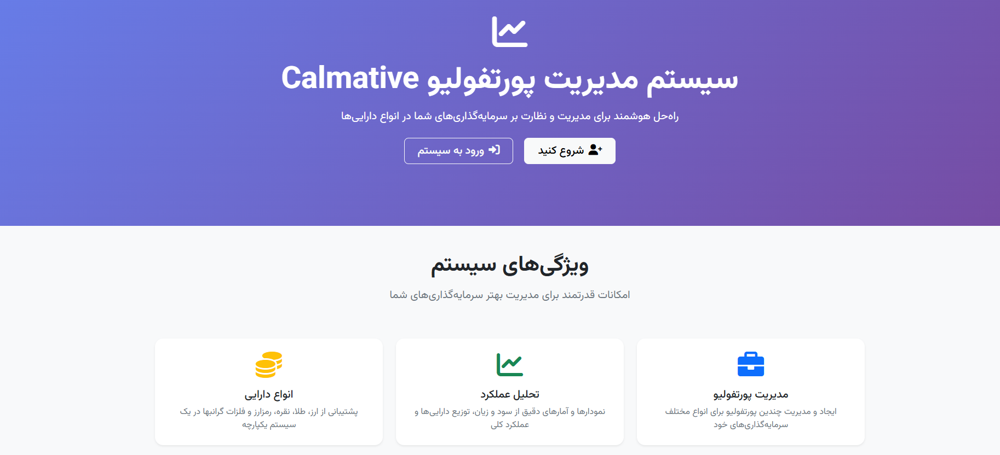

# Calmative Portfolio

A full-stack portfolio management web application built with ASP.NET Core 6.0.  The solution contains three main projects:

1. **Calmative.Server.API** – a RESTful Web API that handles authentication (JWT), email confirmation/reset, portfolio & asset CRUD, price history and dashboard analytics.
2. **Calmative.Web.App** – an MVC web front-end that consumes the API and provides a modern, RTL-friendly UI (Persian) built with Bootstrap 5, Chart.js and jQuery.
3. **Calmative.Admin.Web** – a separate admin panel with hardcoded credentials for administrators to manage users and view their portfolios and activities.



---

## Features

### Authentication & Security
* User registration with email confirmation (SMTP or `smtp4dev` in development).
* JWT-based login, cookie storage on the web app, token validation middleware on the API.
* Forgot/Reset password, change-password inside profile page.
* BCrypt password hashing.

### Portfolio Management
* Unlimited portfolios per user, each containing multiple assets.
* Asset types: Currency, Gold, Silver, Crypto, Precious Metals, Car (extensible enum).
* CRUD for portfolios and assets with modals & confirmation dialogs.
* Automatic price-history logging on asset creation / update.

### Dashboard & Analytics
* Overview cards (total value, investment, P/L, distribution).
* Doughnut & line charts powered by Chart.js.
* Asset type distribution and top performers.

### Admin Interface
* Separate admin panel with hardcoded credentials.
* User management with ability to view and delete users.
* Detailed user information including portfolios and activity history.
* System-wide statistics and metrics.

### Internationalisation / RTL Support
* Fully translated UI (Persian/Farsi).
* Bootstrap RTL build, custom CSS utilities.

### Quality & Tooling
* Entity Framework Core 6 with SQL Server.
* AutoMapper DTO/entity mapping.
* Structured logging via ASP.NET Core logger.
* Docker-compose file for `smtp4dev` (development mail catcher).
* Extensive unit & integration tests **(coming soon)**.

---

## Getting Started

### Prerequisites
* [.NET 6 SDK](https://dotnet.microsoft.com) or newer
* SQL Server (LocalDB is fine) – connection string in `appsettings.Development.json`
* Node/NPM (optional – only if you want to rebuild JS/CSS assets)
* Git

### Clone & Run
```bash
# Clone repository
$ git clone https://github.com/ParsaEnayatiCE/Calmative-Portfolio.git
$ cd Calmative-Portfolio

# Restore & build solution
$ dotnet build src/CalmativePortfolio.sln

# Apply EF Core migrations
$ dotnet ef database update --project src/Server/Calmative.Server.API --startup-project src/Server/Calmative.Server.API

# Start smtp4dev (dev emails) & all apps
$ docker compose up -d smtp
$ dotnet run --project src/Server/Calmative.Server.API
$ dotnet run --project src/Web/Calmative.Web.App
$ dotnet run --project src/Admin/Calmative.Admin.Web
```

The Web App runs at `https://localhost:7294`, the API at `https://localhost:7000`, the Admin Panel at `https://localhost:7500`, and `smtp4dev` UI at `http://localhost:3000`.

### Environment Configuration
Key settings are located in the respective `appsettings*.json` files:
* **JwtSettings** – secret key, issuer, audience, expiry.
* **EmailSettings** – SMTP host, port, credentials.
* **FrontendSettings:BaseUrl** – base URL used when generating confirmation/reset links in emails.
* **AdminCredentials** – username and password for admin access (in `Calmative.Admin.Web`).

---

## Database Migrations
EF Core migrations live under `Calmative.Server.API/Migrations`.
Generate a new migration:
```bash
$ dotnet ef migrations add YourMigrationName --project src/Server/Calmative.Server.API --startup-project src/Server/Calmative.Server.API
```

---

## Docker Support
A minimal `docker-compose.yml` is included for the development mail server:
```yaml
services:
  smtp:
    image: rnwood/smtp4dev
    ports:
      - "3000:80"   # web UI
      - "2525:25"   # SMTP
```
Extend this file to add SQL Server or deploy the app in containers.

---

## Contributing
Pull requests are welcome!  Please open an issue first to discuss major changes.

---

## License
This project is released under the MIT License. 