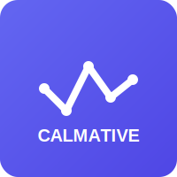

# Calmative Portfolio Management System

<div align="center">
  
  <h1>Calmative Portfolio</h1>
  <h3>A comprehensive portfolio management solution for tracking diverse assets</h3>
  <p>Built with ASP.NET Core 6.0, Entity Framework Core, and modern web technologies</p>
</div>

<div align="center">
  
</div>

## 📋 Overview

Calmative is a full-stack portfolio management system designed to help users track and analyze their investments across various asset classes. The system features a modern, RTL-friendly interface in Persian (Farsi) and provides powerful analytics to help users make informed investment decisions.

The solution consists of three main components:

1. **Server API** - RESTful backend service handling data operations, authentication, and business logic
2. **Web Application** - User-facing MVC frontend for portfolio management
3. **Admin Panel** - Administrative interface for system management and monitoring

## ✨ Key Features

### 📊 Portfolio Management
- Create multiple portfolios for different investment strategies
- Track a wide variety of asset types (currencies, precious metals, crypto, real estate, etc.)
- Custom asset types support through admin panel
- Real-time performance tracking with profit/loss calculations

### 📈 Analytics & Reporting
- Comprehensive dashboard with key performance indicators
- Visual data representation through interactive charts
- Asset distribution analysis
- Historical performance tracking

### 🤖 AI-Powered Recommendations (v2)
- Per-asset advice based on the last 30-days price trend and current allocation
- Labels: «خرید بیشتر» (Buy more), «نگهداری» (Hold) or «کاهش موقعیت» (Reduce)
- Priority (High / Medium / Low) derived from magnitude of the move
- Diversification tips only if the portfolio totally lacks a given asset type (e.g. Real-Estate)
- Recommendations are always generated live – no caching – so edits to price history or asset list are reflected instantly

### 🔐 Security & Authentication
- JWT-based authentication system
- Email verification workflow
- Password reset functionality
- Secure password storage with BCrypt hashing

### 👤 User Management
- User registration and profile management
- Email notifications for important actions
- Role-based access control

### 🛠️ Administration
- Dedicated admin panel with enhanced capabilities
- User management and oversight
- Custom asset type creation
- System monitoring and maintenance tools

## 🏗️ Architecture

The system follows a modern N-tier architecture:

- **Presentation Layer**: MVC views, controllers, and client-side JavaScript
- **Service Layer**: Business logic implementation and API controllers
- **Data Access Layer**: Entity Framework Core with repository pattern
- **Database Layer**: SQL Server database with migrations
- **AI Layer**: Intelligent recommendation system using portfolio analytics

### Technology Stack

- **Backend**: ASP.NET Core 6.0, Entity Framework Core
- **Frontend**: Bootstrap 5 (RTL), Chart.js, jQuery
- **Authentication**: JWT tokens, ASP.NET Core Identity
- **Database**: Microsoft SQL Server
- **AI Services**: Custom recommendation engine with caching
- **Tools**: Docker, SMTP service for emails

## 🚀 Getting Started

### Prerequisites

- [.NET 6 SDK](https://dotnet.microsoft.com/download/dotnet/6.0) or newer
- SQL Server (LocalDB is sufficient for development)
- Docker (optional, for SMTP service)
- Git

### Installation

1. **Clone the repository**

```bash
git clone https://github.com/ParsaEnayatiCE/Calmative-Portfolio.git
cd Calmative-Portfolio
```

2. **Restore dependencies and build the solution**

```bash
dotnet restore src/CalmativePortfolio.sln
dotnet build src/CalmativePortfolio.sln
```

3. **Set up the database**

```bash
dotnet ef database update --project src/Server/Calmative.Server.API --startup-project src/Server/Calmative.Server.API
```

4. **Start the SMTP service (optional)**

```bash
docker compose up -d smtp
```

5. **Run the applications**

```bash
# In separate terminals:
dotnet run --project src/Server/Calmative.Server.API
dotnet run --project src/Web/Calmative.Web.App
dotnet run --project src/Admin/Calmative.Admin.Web
```

### Default URLs

- **Web Application**: https://localhost:7294
- **Server API**: https://localhost:7000
- **Admin Panel**: https://localhost:7500
- **SMTP UI**: http://localhost:3000

## ⚙️ Configuration

Key settings are located in the respective `appsettings.json` files:

### API Settings (`src/Server/Calmative.Server.API/appsettings.json`)

```json
{
  "ConnectionStrings": {
    "DefaultConnection": "Server=localhost,1433;Database=CalmativePortfolioDb;User Id=SA;Password=CalmativePass123!;TrustServerCertificate=true;"
  },
  "JwtSettings": {
    "SecretKey": "your-secret-key-here",
    "Issuer": "calmative-api",
    "Audience": "calmative-clients",
    "ExpiryMinutes": 60
  },
  "EmailSettings": {
    "Host": "localhost",
    "Port": 2525,
    "EnableSsl": false,
    "Username": "",
    "Password": ""
  },
  "FrontendSettings": {
    "BaseUrl": "https://localhost:7294"
  }
}
```

### Admin Credentials (`src/Admin/Calmative.Admin.Web/appsettings.json`)

```json
{
  "AdminCredentials": {
    "Username": "admin",
    "Password": "Admin123!"
  }
}
```

## 🧩 Project Structure

```
src/
├── CalmativePortfolio.sln           # Solution file
├── Server/
│   └── Calmative.Server.API/        # Backend API project
│       ├── Controllers/             # API endpoints
│       ├── Data/                    # Database context
│       ├── DTOs/                    # Data transfer objects
│       ├── Mappings/                # AutoMapper profiles
│       ├── Migrations/              # EF Core migrations
│       ├── Models/                  # Domain entities
│       └── Services/                # Business logic
├── Web/
│   └── Calmative.Web.App/           # User frontend MVC project
│       ├── Controllers/             # MVC controllers
│       ├── Models/                  # View models
│       ├── Services/                # API client services
│       └── Views/                   # Razor views
└── Admin/
    └── Calmative.Admin.Web/         # Admin panel MVC project
        ├── Controllers/             # Admin controllers
        ├── Models/                  # Admin view models
        └── Views/                   # Admin views
```

## 🔄 Database Migrations

Generate a new migration:

```bash
dotnet ef migrations add YourMigrationName --project src/Server/Calmative.Server.API --startup-project src/Server/Calmative.Server.API
```

Apply migrations:

```bash
dotnet ef database update --project src/Server/Calmative.Server.API --startup-project src/Server/Calmative.Server.API
```

## 🐳 Docker Support

A `docker-compose.yml` file is included for development services:

```yaml
services:
  smtp:
    image: rnwood/smtp4dev
    ports:
      - "3000:80"   # Web UI
      - "2525:25"   # SMTP
```

## 🐳 Deployment with Docker Compose

This project ships with production-ready Dockerfiles and a single `docker-compose.yml` that orchestrates the entire stack (SQL Server, SMTP4Dev, API, public Web, Admin panel and Nginx reverse-proxy).

### 1. Build the images

Option A – one by one:
```bash
# From project root
docker build -f Dockerfile.api   -t calmative-api:1.0   .
docker build -f Dockerfile.web   -t calmative-web:1.0   .
docker build -f Dockerfile.admin -t calmative-admin:1.0 .
```

Option B – let Compose build everything that has a `build:` context (if you switch from `image:` to `build:`):
```bash
docker compose build
```

### 2. Start the stack
```bash
docker compose up -d             # starts sqlserver → api → web/admin → nginx
```

Compose waits for each service's health-check before moving to the next so first start-up may take a minute (SQL Server must finish initialization).

### 3. Verify health
```bash
docker compose ps                # HEALTHY column should be healthy for every container

# Optional – detailed health JSON for a container
docker inspect --format '{{json .State.Health}}' calmative-api | jq
```

### 4. Interact with the system

• Public site:        http://localhost/  
• Admin panel:        http://localhost/admin/  
• API (Swagger):      http://localhost/api/swagger

### 5. Tear down
```bash
docker compose down              # stop & remove containers (volumes stay)
```

> ℹ️  Need HTTPS?  See `nginx/nginx.conf` – you can mount certificates and change the port mapping to `443:443`, or place the stack behind a TLS-terminating load balancer.

## 🛠️ Troubleshooting

### Common Issues

1. **Database Connection Errors**
   - Verify your connection string in `appsettings.json`
   - Ensure SQL Server is running
   - Check if migrations have been applied

2. **Email Verification Not Working**
   - Confirm SMTP settings are correct
   - Check if `smtp4dev` is running (if using for development)
   - Verify the frontend URL in `FrontendSettings:BaseUrl`

3. **JWT Authentication Issues**
   - Ensure the secret key is properly set and consistent
   - Check token expiration settings
   - Verify that the client is properly sending the token

## 🤝 Contributing

Contributions are welcome! Please feel free to submit a Pull Request.

1. Fork the repository
2. Create your feature branch (`git checkout -b feature/amazing-feature`)
3. Commit your changes (`git commit -m 'Add some amazing feature'`)
4. Push to the branch (`git push origin feature/amazing-feature`)
5. Open a Pull Request

## 📝 License

This project is licensed under the MIT License - see the [LICENSE](LICENSE) file for details.

## 📞 Contact

Project Link: [https://github.com/ParsaEnayatiCE/Calmative-Portfolio](https://github.com/ParsaEnayatiCE/Calmative-Portfolio) 